# 🎓 Advisor Presentation Guide: HR Management System

This document outlines the system architecture, role-based workflows, and a step-by-step live demonstration script designed to present the HR Management System project to your academic advisor.

---

## 🗺️ System Architecture & User Roles

The system uses a role-based access control (RBAC) model with three distinct dashboards. The application integrates geofenced attendance tracking, dynamic shift management, and leaves approval with automated notification emails.

```mermaid
graph TD
    A[🔒 Secure Login Screen] -->|Role: ADMIN| B[💼 Admin Dashboard]
    A -->|Role: MANAGER| C[📈 HR Manager Dashboard]
    A -->|Role: EMPLOYEE| D[👤 Employee Dashboard]

    subgraph Admin Functions
        B --> B1["👥 Employee Directory (CRUD)"]
        B --> B2["🏢 Department & Geofence Coordinates Setup"]
        B --> B3["⏱️ Global Shift Scheduler (Create & Assign)"]
        B --> B4["💰 Complete System Payroll Reports"]
    end

    subgraph HR Manager Functions
        C --> C1["📝 Pending Leaves: Remarks & Action"]
        C --> C2["🕒 Department Attendance Audits"]
        C --> C3["📊 Employee Performance Evaluations (KPIs)"]
        C --> C4["💵 Process Monthly Payroll Payouts"]
    end

    subgraph Employee Functions
        D --> D1["📍 Geofenced Attendance (Clock In/Out)"]
        D --> D2["📋 Apply for Leave (Mandatory Reason)"]
        D --> D3["📧 Email & System Notifications Audit"]
        D --> D4["💳 Personal Payslip History & Profile"]
    end
```

---

## 🔑 Default Login Credentials

Use these pre-configured user credentials to demonstrate different role perspectives:

| Role | Username | Password | Default Home Route | Core Access Scope |
| :--- | :--- | :--- | :--- | :--- |
| **System Admin** | `admin` | `password` | `/admin/dashboard` | Employees CRUD, Department Geofencing coordinates, Shift settings creation, Global reports. |
| **HR Manager** | `hr` | `password` | `/hr/dashboard` | Leave requests approval (mandatory remarks), Attendance audits, Performance KPIs, Payroll runs. |
| **Employee** | `employee` | `password` | `/employee/dashboard` | Clock-in/out location verification, Leave requests submission, Payslips, Performance reviews view. |

---

## 🎭 Step-by-Step Live Demo Presentation Script

Follow this script during your presentation to highlight the system's features in a logical, story-driven flow.

### 🎬 Scene 1: System Configuration (Admin Persona)
* **Goal**: Show how the system coordinates departments and shift plans.
1. **Login** using `admin` / `password`.
2. Go to **Departments** in the sidebar:
   - Point out the **Office Geolocation Coordinates** settings.
   - Click the **Detect Current Location** button to show integration with the browser's Geolocation API.
3. Go to **Shifts** in the sidebar:
   - Demonstrate the **Create Shift** form. Mention how shifts support name, start time, end time, and grace period minutes.
   - Show the **Grant Shift to Employee** registry where employees are assigned to specific shift schedules.
4. Go to **Employees**:
   - Demonstrate adding a new employee. Mention that passwords are automatically hashed using Bcrypt in the PostgreSQL database layer.

### 🎬 Scene 2: Daily Operations & Request Submission (Employee Persona)
* **Goal**: Show how employees clock in and request leaves with mandatory reasons.
1. **Login** using `employee` / `password`.
2. Go to **Clock In/Out**:
   - Click **Clock In**. Point out that the system verifies whether the employee's current coordinates fall within their department's allowed geofence radius.
3. Go to **Request Leave**:
   - Choose a leave type (e.g., *Sick Leave*).
   - Try submitting without entering a reason to demonstrate **front-end and back-end form validation**.
   - Input a valid cause (e.g., *"Medical checkup at the dentist"*).
   - Click **Submit Leave Request**.
4. Go to **My Leaves** to show the new request logged in the table as `PENDING`, displaying the submitted reason.

### 🎬 Scene 3: Auditing, Processing & Notification Routing (HR Manager Persona)
* **Goal**: Show manager evaluation, required comments validation, and automated notifications.
1. **Login** using `hr` / `password`.
2. Go to **Leave Requests**:
   - Locate the employee's pending request.
   - Click **Reject** to open the review modal.
   - Show that the **Confirm** button is disabled and the remarks text area is styled in red (`is-invalid`) until a rejection remark is typed.
   - Type a rejection remark (e.g., *"Cannot approve due to critical project deadline coverage"*). Click **Confirm**.
   - **Technical Note for Advisor**: Under the hood, Spring Boot calls the `JavaMailSender` service to route an automated HTML email to the employee's inbox detailing the rejection decision and remarks.
3. Go to **Payroll**:
   - Click **Process Payroll** to generate the salary sheet for the current month.
   - Show how the system aggregates base salaries, overtime hours, and approved leaves to calculate net payouts.

---

## 🛠️ Key Technical Implementations to Highlight

Make sure to mention these architectural achievements to your advisor:

* **Automated Geofencing Validation**: Integrates browser Geolocation coordinates (`latitude` and `longitude`) with a backend haversine distance calculation to verify that clock-in actions only occur within the office radius.
* **Cascaded Validation Architecture**: Both client-side inputs (HTML5, Bootstrap validation) and server-side checks (`ResponseStatusException`, validation logic) guarantee that leave reasons and review comments are parsed correctly.
* **Hibernate Entity Schema Updates**: The database entity mappings are designed to automatically update schemas on deployment, reducing schema maintenance.
* **Transactional Email Alerts**: Embedded transactional email templates using Java Mail API to send instant status reports to employees.
