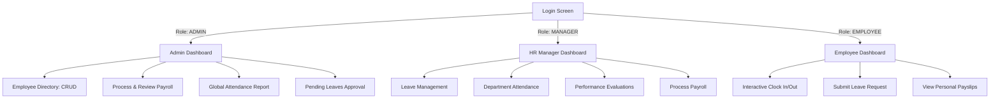

# HR Management System - Demo Flow & Recommendations

This document provides a step-by-step walkthrough of the user flows in this HR/Payroll system, followed by key recommendations for future enhancements.

---

## 🗺️ Project Architecture & User Flow

The system supports three distinct user roles, each with its own dashboard and permissions:
1. **Admin (`ADMIN`)**: Handles system-wide configuration, employee directory management, attendance reporting, leave management, and payroll.
2. **HR / Manager (`MANAGER`)**: Manages leave requests, department attendance reports, performance reviews, and payroll processing.
3. **Employee (`EMPLOYEE`)**: Clocks in/out, views personal attendance records, requests leave, and checks payslips.

---

## 🔑 Demo Login Credentials

You can use the following default accounts to demonstrate the dashboard flows:

| Role | Username | Password | Default Redirect | Description |
| :--- | :--- | :--- | :--- | :--- |
| **Admin** | `admin` | `password` | `/admin/dashboard` | Access to employee management, full payroll and system reports. |
| **HR Manager**| `hr` | `password` | `/hr/dashboard` | Access to department reports, leave approvals, and performance reviews. |
| **Employee** | `employee`| `password` | `/employee/dashboard` | Access to personal profile, clock-in, leaves, and payslips. |

---

## 🏃‍♂️ Step-by-Step Demo Guide

### Flow 1: Daily Employee Operations
1. **Login** as `employee` / `password`.
2. Navigate to **Clock In/Out** via the sidebar:
   - Click the **Clock In** button. The system updates the status in real-time to "PRESENT".
   - Later, click the **Clock Out** button to complete the day's record.
3. Navigate to **Request Leave**:
   - Fill out the form (e.g., Leave Type: `SICK`, Date: Current Month).
   - Click **Submit Request**.
4. Check **My Leaves** to verify that the request is currently marked as `PENDING`.

### Flow 2: HR Manager Approvals & Performance
1. **Login** as `hr` / `password`.
2. On the **HR Dashboard**, you will notice the **Pending Leaves** counter has incremented dynamically.
3. Go to **Leave Requests** in the sidebar:
   - Click **Approve** or **Reject** on the employee's request.
   - Enter optional remarks. The table refreshes dynamically.
4. Go to **Attendance Report**:
   - Filter by department or load active employee rosters to track attendance statuses.
5. Navigate to **Payroll**:
   - Choose **Process Payroll** to run salary calculations for employees.

### Flow 3: Admin & System Management
1. **Login** as `admin` / `password`.
2. Go to **Employees**:
   - Click **Add Employee** to register a new user in the PostgreSQL database.
   - View, edit, or delete existing employee profiles.
3. Go to **Payroll**:
   - Browse the payroll report logs or process payouts.

---

## 🚀 Recommended Features for Future Roadmap

Here are the top-recommended features to elevate this project into a production-ready enterprise product:

### 1. 📧 Automated Notification System
* **Concept:** Send email or push notifications for key actions.
* **Details:**
  - Notify managers when an employee requests a leave.
  - Notify employees when their leave is approved/rejected, or when their monthly payslip is generated.
* **Technology:** Spring Boot Starter Mail (`JavaMailSender`) + Thymeleaf templates for rich HTML emails.

### 2. 📊 Rich Dashboard Analytics (Charts & Graphs)
* **Concept:** Replace the static numeric cards with dynamic data visualizations.
* **Details:**
  - A doughnut chart showing the distribution of leave types.
  - A bar graph displaying monthly payroll expenditures.
  - An attendance rate line chart over the last 30 days.
* **Technology:** Integrate [Chart.js](https://www.chartjs.org/) or [ApexCharts](https://apexcharts.com/) in the frontend pages.

### 3. 📄 PDF Payslip Export & Download
* **Concept:** Allow employees to download their monthly payroll records as standard PDF documents.
* **Details:**
  - Add a "Download PDF" button in the Employee Payroll detail view.
  - Generate formatted, styled PDF receipts with company headers.
* **Technology:** OpenPDF or iText libraries configured in Spring Boot controllers.

### 4. 🗂️ Employee Self-Service Document Vault
* **Concept:** Let employees upload identity documents, certifications, and contracts securely.
* **Details:**
  - Add a file upload widget on the profile edit page.
  - Restrict access so only the specific employee and HR/Admins can view or download the uploaded documents.
* **Technology:** Spring Boot file upload handler + Amazon S3 or local secure directory storage.

### 5. ⏱️ Overtime & Shift Scheduler
* **Concept:** Calculate overtime payments automatically based on clock-in/out timestamps.
* **Details:**
  - Setup a standard 8-hour workday.
  - If an employee clocks out late, automatically calculate overtime hours and add them to their monthly payroll draft.
* **Technology:** Expand `AttendanceController` and `PayrollServiceImpl` calculation helpers.
