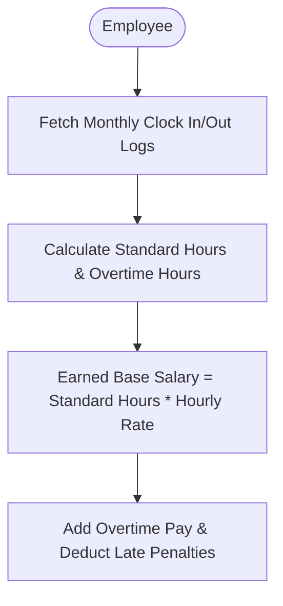

# Presentation: Payroll & Lateness Logic Calculator

This document is designed to present the payroll calculation logic to project advisors and stakeholders. It outlines the hybrid salaried/hourly model, lateness penalty regulations, and how they map to the system's code.

---

## 1. Core Architectural Design: Work Hour Compensation Model

All employee payments (including Full-Time, Part-Time, Contractors, and Interns) are calculated strictly based on their clocked working hours.

### A. Hourly Rate Derivation
The standard hourly rate is derived from the employee's base salary using a divisor of **160 working hours** per month:
$$\text{Hourly Rate} = \frac{\text{Contracted Base Salary}}{160.0 \text{ hours}}$$

### B. Earned Base Salary Calculation
$$\text{Standard Worked Hours} = \max(0.0, \text{Total Clocked Hours} - \text{Overtime Hours})$$
$$\text{Earned Base Salary} = \text{Standard Worked Hours} \times \text{Hourly Rate}$$

---

## 2. Overtime & Compensation Rules

All employees (salaried or hourly) are eligible for overtime compensation when working beyond **8 hours** in a single daily shift.

$$\text{Daily Overtime Hours} = \max(0.0, \text{Total Daily Shift Hours} - 8.0)$$

$$\text{Overtime Rate} = \begin{cases} 
\text{Hourly Rate} \times 1.5 & \text{if } \text{Hourly Rate} > 0 \\ 
\$25.00/\text{hour} & \text{otherwise (fallback)} 
\end{cases}$$

$$\text{Overtime Pay} = \sum(\text{Daily Overtime Hours}) \times \text{Overtime Rate}$$

---

## 3. Lateness & Penalty Calculations

To balance compliance and fairness, the system allows a monthly threshold of **3 excused late arrivals** before applying automated salary penalties.

### A. Punctuality Check (Clock-in)
An arrival is marked `LATE` if the check-in time exceeds the shift's starting time plus the allowed grace period:

$$\text{Threshold Time} = \text{Shift Start Time} + \text{Grace Period}$$

$$\text{Attendance Status} = \begin{cases} 
\text{LATE} & \text{if } t_{\text{clock\_in}} > \text{Threshold Time} \\ 
\text{PRESENT} & \text{otherwise} 
\end{cases}$$

### B. Late Penalty Summation (Payroll Execution)
During monthly payroll processing, the system calculates deductions for late arrivals:

$$\text{Chargeable Lates} = \max(0, \text{Monthly Late Count} - 3)$$
$$\text{Lateness Deduction} = \text{Chargeable Lates} \times \text{Shift's Late Penalty Amount}$$

---

## 4. Final Earnings Ledger

The final net salary disbursed to the employee is computed as follows:

$$\text{Gross Salary} = \text{Earned Base Salary} + \text{Overtime Pay}$$
$$\text{Total Deductions} = \text{Manual Deductions} + \text{Lateness Deduction}$$
$$\text{Net Pay} = \max(0.0, \text{Gross Salary} - \text{Total Deductions})$$

---

## 5. Implementation Code Mapping

For code review or validation, the logic is implemented in these key source files:
*   **Hybrid Calculation & Penalties**: [PayrollServiceImpl.java](file:///home/kukseng/Documents/Project-Resources/src/main/java/com/example/hr_managment_system/service/Impl/PayrollServiceImpl.java#L50-L95)
*   **Punctuality Status Evaluation**: [AttendanceServiceImpl.java](file:///home/kukseng/Documents/Project-Resources/src/main/java/com/example/hr_managment_system/service/Impl/AttendanceServiceImpl.java#L56-L67)
*   **Shift & Penalty Configurations**: [Shift.java](file:///home/kukseng/Documents/Project-Resources/src/main/java/com/example/hr_managment_system/domain/Shift.java)
*   **Payroll Records Entity**: [Payroll.java](file:///home/kukseng/Documents/Project-Resources/src/main/java/com/example/hr_managment_system/domain/Payroll.java)
*   **Payslip PDF Export Logic**: [PdfService.java](file:///home/kukseng/Documents/Project-Resources/src/main/java/com/example/hr_managment_system/service/PdfService.java#L107-L117)
