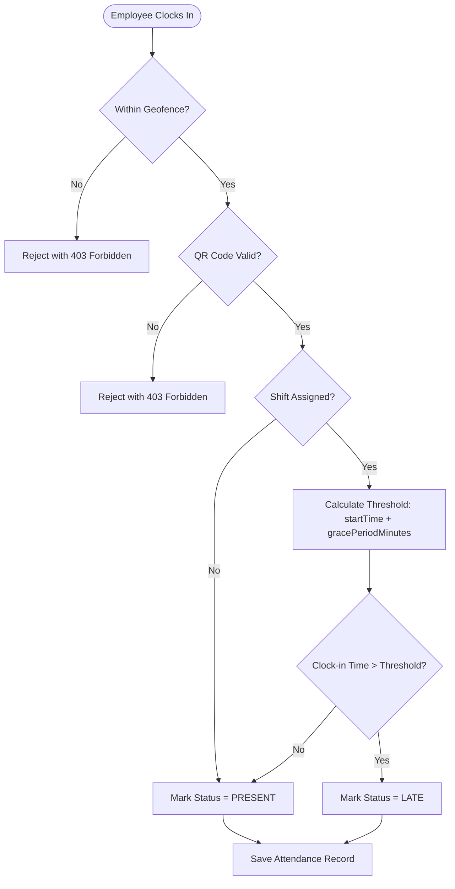
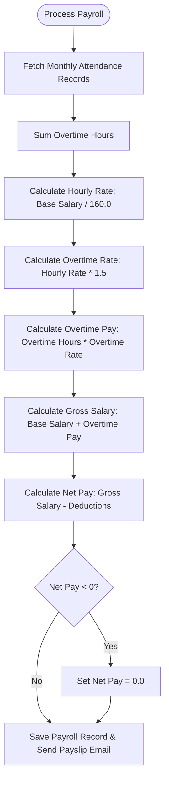

# Lateness and Payroll Logic Documentation

This document outlines the business rules, formulas, and workflows used to calculate attendance status (such as lateness and presence) and process employee payroll (including overtime and deductions) within the Management Payroll System.

---

## 1. Attendance & Clock-In Validation Flow

When an employee attempts to clock in, the system validates their location, department verification token, and automatically checks their punctuality.

### A. Geofence Distance Verification
Before processing attendance, the system validates that the employee is within their department's allowed geographical geofence using the **Haversine Formula**:

$$\text{Distance} = 2 R \cdot \arcsin\left(\sqrt{\sin^2\left(\frac{\Delta \phi}{2}\right) + \cos(\phi_1) \cos(\phi_2) \sin^2\left(\frac{\Delta \lambda}{2}\right)}\right)$$

Where:
*   $R$ is the Earth's radius ($6,371,000 \text{ meters}$).
*   $\phi_1, \phi_2$ are the latitudes in radians.
*   $\Delta \phi$ is the latitude difference in radians.
*   $\Delta \lambda$ is the longitude difference in radians.

If $\text{Distance} > \text{geofenceRadiusMeters}$, the clock-in request is rejected with `403 Forbidden` ("You are outside the department geofence").

> [!NOTE]
> Geofencing coordinates and bounds are defined in [AttendanceServiceImpl.java](file:///home/kukseng/Documents/Project-Resources/src/main/java/com/example/hr_managment_system/service/Impl/AttendanceServiceImpl.java#L242-L269).

---

### B. Lateness Auto-Calculation Formula
Once geofencing and QR codes are validated, the system automatically checks if the employee is late.

$$\text{Threshold Time} = \text{Shift Start Time} + \text{Grace Period Minutes}$$

$$\text{Status} = \begin{cases} 
\text{LATE} & \text{if } t_{\text{clock\_in}} > \text{Threshold Time} \\ 
\text{PRESENT} & \text{otherwise} 
\end{cases}$$

#### Example Scenarios:
| Shift Start Time | Grace Period | Clock-In Time | Calculated Status |
| :--- | :--- | :--- | :--- |
| `09:00 AM` | 15 mins | `09:14 AM` | **PRESENT** (Within grace threshold) |
| `09:00 AM` | 15 mins | `09:16 AM` | **LATE** (Exceeded grace threshold) |
| `09:00 AM` | 0 mins | `09:01 AM` | **LATE** (No grace period configured) |

> [!IMPORTANT]
> If no shift is assigned to the employee, the system defaults their status to `PRESENT`. This calculation can be referenced in [AttendanceServiceImpl.java](file:///home/kukseng/Documents/Project-Resources/src/main/java/com/example/hr_managment_system/service/Impl/AttendanceServiceImpl.java#L56-L67).

---

## 2. Work Duration & Overtime Calculations

When an employee clocks out, their daily hours are updated.

### A. Total Hours worked:
$$\text{Total Hours} = \frac{\text{Clock Out Time} - \text{Clock In Time}}{60 \text{ minutes}}$$

### B. Overtime hours:
Daily overtime hours are accumulated if the employee works more than **8 hours** in a single day:

$$\text{Overtime Hours} = \max(0.0, \text{Total Hours} - 8.0)$$

---

## 3. Payroll & Payslip Logic

Payroll processing consolidates monthly attendance records to calculate earnings and net payments.

### A. Base Hourly Rate Calculation
The standard hourly rate is calculated using a divisor of **160 working hours** per month:

$$\text{Hourly Rate} = \frac{\text{Base Salary}}{160.0}$$

### B. Overtime Compensation Rate
Overtime is paid at **1.5 times** the base hourly rate. If the hourly rate cannot be determined (e.g. Base Salary is zero), a fallback rate is applied:

$$\text{Overtime Rate} = \begin{cases} 
\text{Hourly Rate} \times 1.5 & \text{if } \text{Hourly Rate} > 0 \\ 
\$25.00/\text{hour} & \text{otherwise} 
\end{cases}$$

$$\text{Total Overtime Pay} = \sum(\text{Daily Overtime Hours}) \times \text{Overtime Rate}$$

### C. Gross Salary, Deductions, and Net Pay
*   **Gross Salary**: Consists of the employee's monthly earned base salary plus all calculated overtime earnings.
    $$\text{Gross Salary} = \text{Earned Base Salary} + \text{Total Overtime Pay}$$
    Where **all employees** (including Full-Time) are paid strictly based on clocked hours:
    $$\text{Earned Base Salary} = \text{Standard Hours Worked} \times \text{Hourly Rate}$$
*   **Late Penalty**: Applied automatically for shifts configured with a late penalty. The first 3 late clock-ins per calendar month are free of charge.
    $$\text{Late Penalty} = \max(0, \text{Monthly Late Count} - 3) \times \text{Shift's Late Penalty Amount}$$
*   **Total Deductions**: The sum of manual/default deductions and the calculated late penalties.
    $$\text{Total Deductions} = \text{Manual Deductions} + \text{Late Penalty}$$
*   **Net Pay**: The final amount disbursed to the employee. It cannot go below zero:
    $$\text{Net Pay} = \max(0.0, \text{Gross Salary} - \text{Total Deductions})$$

> [!TIP]
> Standard payroll batch updates, manual deductions, and automated late penalty calculations are handled inside [PayrollServiceImpl.java](file:///home/kukseng/Documents/Project-Resources/src/main/java/com/example/hr_managment_system/service/Impl/PayrollServiceImpl.java#L47-L83).

---

## 4. Key Code References

For modifications to calculation rules, refer directly to these files:
*   **Clock-in & Geo-fencing Validation**: [AttendanceServiceImpl.java](file:///home/kukseng/Documents/Project-Resources/src/main/java/com/example/hr_managment_system/service/Impl/AttendanceServiceImpl.java)
*   **Payroll Process & Overtime Rules**: [PayrollServiceImpl.java](file:///home/kukseng/Documents/Project-Resources/src/main/java/com/example/hr_managment_system/service/Impl/PayrollServiceImpl.java)
*   **Shift & Grace Period Model**: [Shift.java](file:///home/kukseng/Documents/Project-Resources/src/main/java/com/example/hr_managment_system/domain/Shift.java)
*   **Attendance Domain Entity**: [Attendance.java](file:///home/kukseng/Documents/Project-Resources/src/main/java/com/example/hr_managment_system/domain/Attendance.java)
*   **Payroll Domain Entity**: [Payroll.java](file:///home/kukseng/Documents/Project-Resources/src/main/java/com/example/hr_managment_system/domain/Payroll.java)
